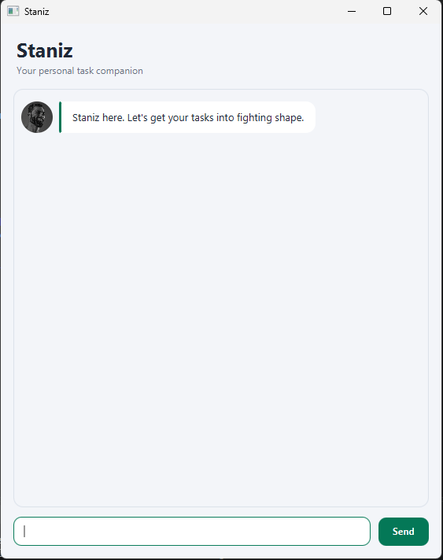

# Staniz User Guide

Staniz is your personal task companion: a disciplined training partner that
helps you capture objectives, track important dates, and finish what you start.
You interact with Staniz by entering short commands into its chat window.



## Quick start

### Requirements

- Java Development Kit (JDK) 25
- The `staniz.jar` application file

### Checking Java

Open a terminal and confirm that the active Java version begins with `25`:

```text
java -version
```

Install or select JDK 25 before continuing if a different version is reported.

### Starting a pre-built JAR

1. Put `staniz.jar` in a folder where Staniz may create its `data` directory.
2. Open a terminal in that folder.
3. Run `java -jar staniz.jar`.
4. Enter a command in the text field and press **Enter** or select **Send**.

### Building and starting the JAR from source

Open a terminal in the repository root—the folder containing `gradlew` and
`build.gradle`—and run the commands for your operating system:

#### Windows PowerShell

```powershell
.\gradlew shadowJar
java -jar .\release\staniz.jar
```

#### macOS/Linux

```bash
./gradlew shadowJar
java -jar release/staniz.jar
```

The first command compiles Staniz and packages its JavaFX and runtime
dependencies into `release/staniz.jar`. The second command launches that JAR.

To launch directly from source without first creating a JAR, run `.\gradlew run`
on Windows or `./gradlew run` on macOS/Linux.

### Performing a manual smoke test

For an isolated test, copy `staniz.jar` into a new empty folder and launch it
from that folder. This prevents existing task data from changing the expected
task numbers. Enter the following commands one at a time:

```text
todo read Clean Code
deadline submit report /by 2026-09-10
event project retreat /from 2026-09-12 /to 2026-09-14
list
mark 1
find report
unmark 1
delete 1
deadline invalid example /by 10-09-2026
list
bye
```

Check that:

- the first three commands add a to-do, deadline, and event;
- the first `list` displays all three tasks in insertion order;
- `mark`, `find`, `unmark`, and `delete` report the selected task correctly;
- the invalid date produces guidance and does not change the task list;
- the second `list` therefore contains the two undeleted tasks; and
- `bye` displays the farewell before closing the window.

After `bye` closes Staniz, relaunch it if you also want to verify that the two
remaining tasks are restored from `data/staniz.txt`.

## Reading the task list

Staniz displays each task with a type and completion marker:

| Symbol | Meaning |
| --- | --- |
| `[T]` | To-do |
| `[D]` | Deadline |
| `[E]` | Event |
| `[ ]` | Incomplete |
| `[X]` | Completed |

For example, `[D][ ] Submit report (by: Sep 10 2026)` is an incomplete
deadline.

## Command overview

| Action | Command format |
| --- | --- |
| Add a to-do | `todo DESCRIPTION` |
| Add a deadline | `deadline DESCRIPTION /by DATE` |
| Add an event | `event DESCRIPTION /from START_DATE /to END_DATE` |
| Show all tasks | `list` |
| Search task descriptions | `find KEYWORD` |
| Mark a task completed | `mark TASK_NUMBER` |
| Mark a task incomplete | `unmark TASK_NUMBER` |
| Delete a task | `delete TASK_NUMBER` |
| Exit Staniz | `bye` |

Command words and search keywords are case-sensitive. Dates must use the
`yyyy-MM-dd` format, such as `2026-09-10`. Staniz accepts extra spaces or tabs
around command elements.

### Syntax notation

- Type command words such as `todo` and parameter words such as `/by` exactly as
  shown.
- Replace uppercase placeholders such as `DESCRIPTION`, `DATE`, and
  `TASK_NUMBER` with your own values; do not type the placeholder itself.
- Descriptions and search keywords must contain at least one non-whitespace
  character.
- `TASK_NUMBER` is a one-based whole number taken from `list`.
- `DATE`, `START_DATE`, and `END_DATE` must be real calendar dates in
  `yyyy-MM-dd` format.
- `list` and `bye` take no additional arguments.

## Adding a to-do

Use `todo` for an objective without a specific date.

Format: `todo DESCRIPTION`

Example:

```text
todo read Clean Code
```

Expected result:

```text
Good. Another objective locked in:
  [T][ ] read Clean Code
```

## Adding a deadline

Use `deadline` for an objective that must be completed by a particular date.
Specify `/by` exactly once.

Format: `deadline DESCRIPTION /by DATE`

Example:

```text
deadline submit report /by 2026-09-10
```

Expected result:

```text
Good. Another objective locked in:
  [D][ ] submit report (by: Sep 10 2026)
```

## Adding an event

Use `event` for an activity with a start date and an end date. Specify `/from`
and `/to` exactly once each, in that order. The start date may be the same as the
end date, but it cannot be later.

Format: `event DESCRIPTION /from START_DATE /to END_DATE`

Example:

```text
event project retreat /from 2026-09-12 /to 2026-09-14
```

Expected result:

```text
Good. Another objective locked in:
  [E][ ] project retreat (from: Sep 12 2026 to: Sep 14 2026)
```

## Listing tasks

Use `list` to show the complete training plan in its saved order.

Format: `list`

Example result:

```text
Current training plan:
1.[T][ ] read Clean Code
2.[D][ ] submit report (by: Sep 10 2026)
3.[E][ ] project retreat (from: Sep 12 2026 to: Sep 14 2026)
```

The task numbers in this list are the numbers used by `mark`, `unmark`, and
`delete`.

## Finding tasks

Use `find` to show tasks whose descriptions contain a keyword. Matching is
case-sensitive and also finds partial words.

Format: `find KEYWORD`

Example:

```text
find report
```

Example result:

```text
Matching objectives:
1.[D][ ] submit report (by: Sep 10 2026)
```

The numbers in search results are local to those results. To change or delete a
task, use its number from `list`, not its number from `find`.

## Marking a task as completed

Use the task's number from `list`.

Format: `mark TASK_NUMBER`

Example:

```text
mark 1
```

Expected result:

```text
Strong work. One more task conquered:
  [T][X] read Clean Code
```

## Marking a task as incomplete

Use `unmark` when a completed task needs more work.

Format: `unmark TASK_NUMBER`

Example:

```text
unmark 1
```

Expected result:

```text
Reset accepted. This objective is active again:
  [T][ ] read Clean Code
```

## Deleting a task

Use the task's number from `list`. The tasks after it are renumbered
automatically.

Format: `delete TASK_NUMBER`

Example:

```text
delete 1
```

Example result:

```text
Cutting dead weight. This task is gone:
  [T][ ] read Clean Code
You have 2 objectives left in the program.
```

## Exiting Staniz

Use `bye` without any additional arguments. Staniz displays its farewell and
then closes the window.

Format: `bye`

Expected result:

```text
Session complete. Stay disciplined.
```

## Saving task data

Staniz saves changes automatically after successfully adding, marking,
unmarking, or deleting a task. It restores those tasks the next time it starts.
The data is stored at `data/staniz.txt`, relative to the folder from which the
application was launched.

Avoid editing the data file manually. Invalid saved data is reported at startup
instead of being silently discarded.

## Troubleshooting commands

If a command cannot be processed, Staniz explains what is wrong and usually
shows a valid example. Common causes include:

- leaving out a task description, keyword, date, or task number;
- entering a task number that is not present in `list`;
- using a date that is not in `yyyy-MM-dd` format;
- repeating `/by`, `/from`, or `/to`;
- placing `/to` before `/from` in an event; or
- adding arguments after `list` or `bye`.

Rejected commands do not change the saved task list. Correct the command using
the guidance in the error message and submit it again.
